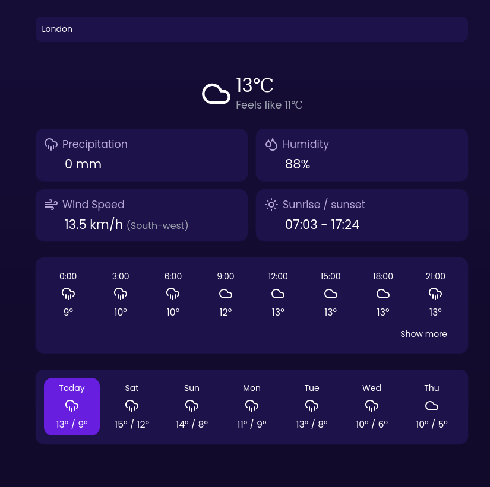

# Forecast App

A modern weather forecast application built as a learning project using TypeScript, React, Vite, and TailwindCSS. The app provides hour-by-hour and weekly weather forecasts with a clean, modern UI.

[Live demo here](https://forecast-app-henna.vercel.app)



## Features

- **Hour-by-Hour Forecast**: Detailed hourly weather predictions
- **Weekly Forecast**: Extended 7-day weather outlook
- **Modern UI**: Clean, responsive interface built with TailwindCSS

## Tech Stack

- TypeScript
- React
- Vite
- TailwindCSS
- [Open-Meteo API](https://open-meteo.com/) for weather data

## Getting Started

### Prerequisites

- Node.js (v14 or higher)
- npm or yarn

### Installation

1. Clone the repository:
   ```bash
   git clone https://github.com/yourusername/forecast-app.git
   ```

2. Navigate to the project directory:
   ```bash
   cd forecast-app
   ```

3. Install dependencies:
   ```bash
   npm install
   ```

4. Start the development server:
   ```bash
   npm run dev
   ```

5. Open your browser and visit `http://localhost:5173`

## Usage

The app allow you to search for a specific location to view weather forecasts.

## API Integration

This project uses the Open-Meteo API, a free and open-source weather API that doesn't require an API key for basic usage.

## Contributing

As this is a learning project, contributions, suggestions, and feedback are welcome. Feel free to open issues or submit pull requests.

## License

[MIT](LICENSE)
